# Email funnel

The post-submit path as implemented in the working tree on 2026-09-24: from the waitlist POST to the confirmed row, including the outbox, the Resend webhook, suppression, the founder slot, the public statistic and the two reporting views. Everything here is read from the code; where a behaviour is a decision rather than code, it says so.

## Where things live

| Piece | Code |
|---|---|
| Signup, confirm, resend, unsubscribe state transitions | `backend/src/main/java/com/fredvested/web/service/SignupService.java` |
| Sending (claim, suppression check, token minting, Resend call, retries) | `backend/src/main/java/com/fredvested/web/service/EmailOutboxPublisher.java` |
| Resend API client | `backend/src/main/java/com/fredvested/web/service/EmailService.java` |
| The two email templates | `backend/src/main/java/com/fredvested/web/service/EmailTemplates.java` |
| Token generation and hashing | `backend/src/main/java/com/fredvested/web/service/ConfirmationTokens.java` |
| Webhook signature check | `backend/src/main/java/com/fredvested/web/service/ResendWebhookVerifier.java` |
| Webhook recording and application | `backend/src/main/java/com/fredvested/web/service/EmailEventProcessor.java` |
| Per-address resend limiter | `backend/src/main/java/com/fredvested/web/service/AddressRateLimiter.java` |
| Per-IP limiter (shared with the signup POST) | `backend/src/main/java/com/fredvested/web/service/RateLimiterService.java` |
| Redirect targets on the landing site | `backend/src/main/java/com/fredvested/web/service/LandingUrls.java` |
| `POST /api/waitlist`, `GET /api/waitlist/stats` | `backend/src/main/java/com/fredvested/web/controller/WaitlistController.java` |
| `/api/waitlist/confirm`, `/api/waitlist/unsubscribe`, `/api/waitlist/resend-confirmation` | `backend/src/main/java/com/fredvested/web/controller/WaitlistConfirmationController.java` |
| `POST /api/webhooks/resend` | `backend/src/main/java/com/fredvested/web/controller/ResendWebhookController.java` |
| Entities | `backend/src/main/java/com/fredvested/web/model/{WaitlistEntry,EmailMessage,EmailEvent}.java` |
| Repositories | `backend/src/main/java/com/fredvested/web/repository/{WaitlistRepository,EmailMessageRepository,EmailEventRepository}.java` |
| Schema: columns, `email_message`, `email_event`, views | `backend/src/main/resources/db/migration/V4__email_outbox_events_and_confirmation.sql` |
| Schema: `confirmed_source`, legacy backfill, view v2 | `backend/src/main/resources/db/migration/V5__confirmed_source_and_legacy_backfill.sql` |
| Landing pages | `frontend/index.html`, `frontend/about.html` (pending state), `frontend/confirmed.html` (result page and resend form), `frontend/assets/waitlist.js` (API calls), `frontend/assets/analytics.js` (`Waitlist Confirmed`) |

## Configuration

From `backend/src/main/resources/application.properties` and the profile files. A blank environment variable is treated as unset (`backend/src/main/java/com/fredvested/web/config/BlankEnvironmentVariables.java`, registered in `META-INF/spring.factories`), so the default applies.

| Property | Env var | Default | Notes |
|---|---|---|---|
| `waitlist.double-opt-in.enabled` | `WAITLIST_DOUBLE_OPT_IN` | `true` | `false` = single opt-in: row confirmed at signup, welcome email instead of confirmation |
| `waitlist.confirmation.ttl-days` | (none) | `7` | Confirmation link lifetime; also printed in the email |
| `api.public-url` | `API_PUBLIC_URL` | base `http://localhost:8081`, dev `https://lpapi-dev.fredvested.com`, prod `https://lpapi.fredvested.com` | Origin of every emailed link. Trailing slashes dropped. A public host is forced to `https` whatever the value says; only `localhost`, `127.0.0.1`, `::1`, `[::1]` and the private LAN ranges `192.168.*`, `10.*` and `172.16-31.*` keep `http` (`EmailOutboxPublisher.publicBaseUrl`) |
| `email.from` | `EMAIL_FROM` | `FRED <fred@fredvested.com>` | Resend from header |
| `email.postal-address` | `POSTAL_ADDRESS` | base `[PO Box pending]`; prod none, required | Rendered in every email footer. `application-prod.properties` sets `email.postal-address=${POSTAL_ADDRESS}` with no default, so production fails startup without it (a blank value counts as unset, see above), exactly like `RESEND_API_KEY`; the `[PO Box pending]` placeholder can only ever appear in dev and local |
| `email.outbox.poll-ms` | (none) | `5000` | Publisher poll interval (fixed delay); initial delay 10 s (`email.outbox.initial-delay-ms`, default in the annotation) |
| `email.outbox.max-attempts` | (none) | `12` | After this many failed sends the row is `failed` |
| `email.outbox.stale-sending-minutes` | (none) | `15` | A row left in `sending` this long is retried |
| `resend.api-key` | `RESEND_API_KEY` | dev and local `re_test_placeholder`; prod required | Not defined in the base file, and `EmailService`'s `@Value` has no default, so a profile must supply it |
| `resend.webhook-secret` | `RESEND_WEBHOOK_SECRET` | base empty; prod required | The dashboard's `whsec_...` value. Empty or not valid base64 = every delivery answered 401 |
| `landing.url` | `LANDING_URL` (dev only) | `https://fredvested.com` (the `@Value` default in `LandingUrls`; not in the base or prod file), dev `https://develop.fredvested-landing-page.pages.dev`, local `same-host` | Where confirm and unsubscribe redirect. `same-host` means `http://<request host>:5500/<page>.html` |
| `waitlist.stats-cache-ms` | (none) | `30000` | `GET /stats` memoisation; not in the properties file, default in `@Value` |

Not configurable: founder cap `SignupService.FOUNDER_CAP = 300`; publisher batch `EmailOutboxPublisher.BATCH = 25`; backoff cap `MAX_BACKOFF = 6h`; webhook body cap `ResendWebhookController.MAX_BODY_BYTES = 64 * 1024`; webhook timestamp tolerance `ResendWebhookVerifier.TOLERANCE_SECONDS = 300`.

## Sequence

```mermaid
sequenceDiagram
    autonumber
    participant B as Browser (index.html or about.html)
    participant API as API (WaitlistController, SignupService)
    participant DB as MySQL
    participant PUB as EmailOutboxPublisher (scheduled)
    participant RS as Resend
    participant MAIL as Mail client or link scanner
    participant CP as confirmed.html

    B->>API: POST /api/waitlist (email, turnstileToken, calculator and attribution fields)
    API->>DB: one transaction: INSERT waitlist_signups (WAITLISTNORMAL, confirmed_at NULL) and INSERT email_message (pending, waitlist_confirmation)
    API-->>B: 200 with status, count, requiresConfirmation true
    Note over B: "One more step: check your email." localStorage waitlist_status = pending_confirmation, waitlist_pending = {email, at}

    loop every 5 s, up to 25 due rows, oldest first
        PUB->>DB: UPDATE email_message SET status = sending (atomic claim, attempts plus one)
        PUB->>DB: load waitlist row. Suppressed? Already confirmed? Then finish without sending
        PUB->>DB: store SHA-256 of a fresh unsubscribe token and a fresh confirmation token, expires now plus 7 days
        PUB->>RS: emails.send from FRED fred@fredvested.com, html and text, headers List-Unsubscribe and List-Unsubscribe-Post
        RS-->>PUB: message id
        PUB->>DB: email_message sent, resend_email_id. waitlist confirmation_sent_at, email_status sent
    end

    RS->>MAIL: confirmation email. Raw tokens exist only in this message
    MAIL->>API: GET /api/waitlist/confirm?token=RAW (no side effect. HEAD is a no-op)
    API-->>MAIL: self-contained HTML: hidden form, inline script that submits it, noscript button
    MAIL->>API: POST /api/waitlist/confirm token=RAW (the script on load, or the noscript button)
    API->>DB: find by token hash. Decide the founder slot first, then set confirmed_at, confirmed_source double_opt_in, clear the hash, save. Publish WaitlistCountsChanged
    API-->>MAIL: 302 to LANDING/confirmed?status=confirmed&hours=BAND&tier=founder|normal
    MAIL->>CP: GET /confirmed?status=confirmed&hours=BAND&tier=TIER
    Note over CP: "You're confirmed." Because hours is present: localStorage waitlist_status = WAITLISTFOUNDER|WAITLISTNORMAL, waitlist_pending removed, Waitlist Confirmed fired on production hosts, then hours and tier stripped from the URL

    RS->>API: POST /api/webhooks/resend with svix-id, svix-timestamp, svix-signature
    API->>DB: verify HMAC over the raw body. INSERT email_event (UNIQUE svix_id). Apply under a row lock on email_message
    API-->>RS: 200 status ok or duplicate
```

## 1. Signup transaction

`WaitlistController.joinWaitlist` (`POST /api/waitlist`), in order: geo gate (`waitlist.us-only`, header `CF-IPCountry` must equal `US`, case-insensitive), IP rate limit (`RateLimiterService`: 3 per 60 s per SHA-256 of `CF-Connecting-IP`, falling back to the remote address), Turnstile, then the duplicate check.

- **Duplicate address** (`repository.existsByEmail`, then `repository.findByEmail`): two cases.
  - **On the list but unconfirmed, double opt-in on** (`signupService.isDoubleOptIn() && !existing.isConfirmed()`): answered exactly like a fresh signup: 200 with `status: "WAITLISTNORMAL"`, `requiresConfirmation: true`, no `realStatus`, never `already_joined`. Nothing in the response says the address was already known (the controller comment: not a confirmation-status oracle). If `AddressRateLimiter.allow(email)` permits (1 per 10 min and 3 per 24 h per address, the same bean and key as `/resend-confirmation`, section 5) the controller calls `SignupService.requestResend`, which retires any pending confirmation and queues a fresh one; over the limit the response is identical and nothing is queued. The waitlist row itself is not written. Tests: `WaitlistControllerAlreadyJoinedTest.unconfirmedDuplicate_looksExactlyLikeAFreshSignup_andQueuesAFreshConfirmation` and `unconfirmedDuplicate_overTheAddressLimit_stillLooksFresh_butQueuesNothing`.
  - **Confirmed, or double opt-in off**: 200 with `status: "already_joined"` and `realStatus` (the row's current status, `WAITLISTNORMAL` if null). Nothing is written and no email is queued (`confirmedDuplicate_isStillAlreadyJoined_withItsRealStatus`, `withDoubleOptInOff_aDuplicateIsAlreadyJoined_asBefore`).
  - The page (`index.html`, `about.html`) cannot tell an unconfirmed re-submit from a new signup: it computes `pending` as `data.requiresConfirmation === true`, fires `Waitlist Submitted` and shows the pending card again. Only a confirmed duplicate fires `Waitlist Failed` with `reason: "duplicate"` and shows the success card ("You’re already on the list."); it stores `realStatus` as `waitlist_status`, so a later reload shows that status's note.
- **New address**: `SignupService.createSignup` runs in one `@Transactional` method: it saves the `waitlist_signups` row and then `enqueue`s an `email_message` row (`status = 'pending'`, `attempts = 0`, `queued_at = now`). A crash between the two rolls both back. Nothing on the request thread calls Resend.
  - With double opt-in on: `status = WAITLISTNORMAL` as a placeholder, `confirmed_at` and `confirmed_source` null, template `waitlist_confirmation`. No founder slot is taken.
  - With the flag off: the status is decided first by `founderSlotStatus()`, before `createSignup` sets anything on the entity the controller handed it (the same ordering as `confirm`, section 8), then `confirmed_at = now`, `confirmed_source = 'single_opt_in'`, template `waitlist_welcome`, and `SignupService.WaitlistCountsChanged` is published (section 9).
- The response is the stats map plus `requiresConfirmation` (the flag's value). The page stores `waitlist_status = "pending_confirmation"` in `localStorage`, and the pending address as JSON `{email, at}` under the key `waitlist_pending` (`frontend/assets/waitlist.js` `savePendingEmail`; `PENDING_KEY`), then shows "One more step: check your email." (`index.html` `showPending`) with two controls: "resend the email" (`pending-resend`) and "Wrong address? Use a different one" (`pending-reset`). `getPendingEmail()` treats a record older than `PENDING_MAX_AGE_MS` (7 days, the link's own lifetime) as absent and clears it, so on the next visit a browser whose confirmation was clicked elsewhere finds `pending_confirmation` with no address, calls `clearStatus()` and gets the form back. The address is also held in the page variable `pendingEmailMemory` for the session, so "resend the email" still works with storage blocked (with neither, the form is restored with "Enter your email again and we’ll send a new link."). `pending-reset` calls `restoreForm()`, which clears `waitlist_pending` (`clearPendingEmail`) and `waitlist_status` (`clearStatus`), calls `resetForm()` and `ts.reset()` (a fresh Turnstile token) and shows the form again; `about.html` also restores the nav label ("Get my Freedom Date").
- The controller clears its stats cache (`cachedStats = null`) after a new signup, and also whenever `SignupService.WaitlistCountsChanged` is published (section 9). Under double opt-in the signup itself changes nothing the statistic counts, so that first clear is harmless.

## 2. Outbox publisher

`EmailOutboxPublisher.publishPending` runs on `@Scheduled(fixedDelay = email.outbox.poll-ms)`. Each run fetches up to 25 due rows (`EmailMessageRepository.findDue`, ordered by `queued_at`): `status = 'pending'` with `next_attempt_at` null or past, plus `status = 'sending'` whose `status_updated_at` is at least `stale-sending-minutes` old. Each row is handled in `publish`; a `RuntimeException` is logged per row and the loop continues.

Per message:

1. **Claim.** `EmailMessageRepository.claim` is a single `@Modifying` JPQL update: `update EmailMessage m set m.status = 'sending', m.attempts = m.attempts + 1, m.statusUpdatedAt = :now where m.id = :id and (m.status = 'pending' or (m.status = 'sending' and m.statusUpdatedAt <= :stale))`. If it updates 0 rows another publisher got it and this one returns. Two publishers (a deploy overlap, a second replica) can therefore never both send the same row.
2. **Waitlist row missing** (cascade delete): `status = 'failed'`, `last_error = "waitlist row missing"`.
3. **Suppression check.** `WaitlistEntry.isSuppressed()` (`suppressed_at` not null) means `status = 'suppressed'`, `last_error = "address suppressed: <reason>"`, no send. Suppression is enforced here, in the sending path, not only recorded by the webhook.
4. **Already confirmed** (confirmation template only): `status = 'skipped'`, `last_error = "already confirmed"`.
5. **Token minting, at send time.** `ConfirmationTokens.generate()` draws 32 bytes from `SecureRandom`, base64url without padding (43 characters); the stored value is the hex SHA-256 (64 characters). One unsubscribe token per message: hash into `email_message.unsubscribe_token_hash`. For a confirmation, one confirmation token: `WaitlistRepository.setConfirmationToken` writes `confirmation_token_hash` and `confirmation_expires_at = now + ttl-days` with a targeted `UPDATE`. Raw values go into the rendered email and nowhere else. Each send overwrites the previous confirmation hash, so only the most recent confirmation link for an address works.
6. **Send.** `EmailService.send(to, subject, html, text, headers)` calls Resend `emails.send` with from, to, subject, html, text and, when the map is non-empty, `headers`, and returns Resend's message id. The publisher passes the RFC 8058 one-click pair on every email, confirmation and welcome alike: `List-Unsubscribe: <unsubscribe url>` and `List-Unsubscribe-Post: List-Unsubscribe=One-Click`, where the URL is the same per-message unsubscribe link as the footer's, so a mail client's unsubscribe control POSTs to it without showing a page (section 4). `EmailOutboxPublisherTest.confirmationSend_mintsHashedTokens_storesTheResendId_andStampsTheSend` checks both headers.
7. **Success.** `resend_email_id`, `status = 'sent'`, `sent_at`, `next_attempt_at = null`, `last_error = null`; then on the waitlist row `markConfirmationSent` (`email_status = 'sent'`, `confirmation_sent_at`) for a confirmation or `setEmailStatus('sent')` for a welcome. Waitlist columns are only ever written with targeted `UPDATE`s, never by saving the entity loaded before the network call, so a confirmation, unsubscribe or bounce that lands during the Resend call is not undone.
8. **Failure.** `last_error` = exception class and message, truncated to 500 characters. If `attempts >= max-attempts` (12): `status = 'failed'`, `next_attempt_at = null`, waitlist `email_status = 'failed'`. Otherwise `status = 'pending'` and `next_attempt_at = now + backoff(attempts)`.

**Backoff** (`EmailOutboxPublisher.backoff`): `2^(attempts - 1)` minutes, exponent capped at 10, duration capped at 6 hours: 1, 2, 4, 8, 16, 32, 64, 128, 256 min, then 6 h, 6 h. Twelve attempts therefore span about 20.5 hours of waiting plus polling granularity; the comment on `email.outbox.max-attempts` in `application.properties` says the same ("12 attempts span about 20 hours").

**Stale recovery.** A publisher that dies after the claim leaves the row in `sending`; after `stale-sending-minutes` it is fetched and claimed again. The class comment states the consequence: a crash between the send and recording its result can double-send once. See Known gaps for what that does to the token.

### `email_message.status` values (`EmailMessage`)

| Status | Set by | Meaning |
|---|---|---|
| `pending` | signup, resend, failed attempt | Due when `next_attempt_at` is null or past |
| `sending` | claim | Held by a publisher run |
| `sent` | publisher, `email.sent` | Resend accepted it; `resend_email_id` set |
| `delivered` | `email.delivered` | |
| `bounced` | `email.bounced` | |
| `complained` | `email.complained` | |
| `failed` | max attempts, `email.failed` | |
| `suppressed` | publisher | Never sent: address suppressed at claim time |
| `skipped` | publisher, resend | Never sent: already confirmed, or superseded by a resend request |

`waitlist_signups.email_status` is the denormalised latest status for the address, written by the publisher and by the webhook.

## 3. The confirmation email

`EmailTemplates.confirmation(confirmUrl, unsubscribeUrl, ttlDays, postalAddress)`. Consent only: this is a decision by Andrew on counsel's advice (2026-09-24), recorded in the class comment and enforced by `EmailTemplatesTest.confirmationEmail_isConsentOnly_andCarriesNoPromotionalCopy`, whose deny-list (founder, 300, spots, pricing, beta, waves, 48 hours, claim, invite, "what happens next", and so on) is checked case-insensitively across subject, HTML and text.

| Part | Content |
|---|---|
| Subject | `Confirm your email for FRED's waitlist` |
| Body | One sentence on why they are receiving it ("because this address was entered on the waitlist form at fredvested.com"), the confirm link (button "Confirm my email" in HTML, bare URL in text), "This link expires in 7 days. If you didn't sign up, you can ignore this email and nothing will happen." |
| Sign-off | "The FRED Team", `help@fredvested.com` |
| Footer | Unsubscribe link, then `FREDvested LLC, <postal address>` (HTML-escaped) |

Both parts (HTML and plain text) carry the unsubscribe link and the postal address. The recipient's address does not appear in the body. The HTML uses web-safe and system font stacks only, no images, no stylesheet links, and the "FRED" wordmark is text. It carries no `http://` links when `api.public-url` is an https origin, which `publicBaseUrl` guarantees for every public host; only the local profile (`http://localhost:8081`) produces http links. Links are `<api.public-url>/api/waitlist/confirm?token=<raw>` and `<api.public-url>/api/waitlist/unsubscribe?token=<raw>`. The message headers carry the unsubscribe URL a second time, as `List-Unsubscribe` with `List-Unsubscribe-Post` (section 2, step 6).

The welcome email (`EmailTemplates.welcome`, subject `You're in`) is used only when double opt-in is off. It carries the "what happens next" block and the same footer.

## 4. Confirm and unsubscribe links (two-step)

Both emailed links are two-step, a decision by Andrew on 2026-09-24 (commit `0d82951`); the rationale is in the `WaitlistConfirmationController` class comment: mail security scanners fetch every link in a message, and a bare GET would have consumed the single-use token or silently unsubscribed the recipient. The two pages differ in step one: the confirm page submits itself with a script, the unsubscribe page does not (its reasons are below).

**Step one, GET.** `GET /api/waitlist/confirm?token=` renders a self-contained HTML page (`autoPostPage`, used by the confirm page only): `Cache-Control: no-store`, `<meta name="robots" content="noindex">`, an inline `<style>` and an inline `<script>`, nothing fetched from anywhere. It contains a `<form id="f" method="post" action="/api/waitlist/confirm">` whose only input is `<input type="hidden" name="token">` (value HTML-escaped), a `Confirming your email address&hellip;` line (`
`) that ships with the `hidden` attribute, an inline script that clears `hidden` and calls `submit()` on the form, and a `<noscript>` block inside the form with the only visible control: "Click the button to confirm your email address." and a button labelled `Confirm my spot`. The GET never looks the token up, so the page is identical for any token apart from the token value itself (`WaitlistConfirmationControllerTest.confirmGet_looksTheSame_forAnyToken_soItRevealsNothing`).

`GET /api/waitlist/unsubscribe?token=` (`unsubscribePage`) is deliberately not auto-submitted. When `SignupService.hasUnsubscribeToken` finds the hash (a read, no side effect) it renders the same shell (`htmlPage`: `Cache-Control: no-store`, `noindex`, inline `<style>` only) with the title "Unsubscribe from FRED emails", the line "Click below to stop receiving emails from FRED at this address.", a `<form method="post" action="/api/waitlist/unsubscribe">` holding the hidden escaped `token` and one always-visible button labelled `Unsubscribe`, and no `<script>` at all (`unsubscribeGet_onlyShowsAButton_andNeverSuppresses_andNeverAutoSubmits`). Otherwise a notice page "This unsubscribe link isn't valid. It may have been cut short by your email app." with no form (`unsubscribeGet_withAnUnknownToken_showsANotice_withoutAForm`). The reason, from the method comment: a suppression is never cleared (section 7), so a mail security sandbox that does execute JavaScript (Defender Safe Links, Proofpoint, Mimecast) must not be able to unsubscribe the recipient on delivery; a human click is required. The confirm page can afford its auto-submit because a consumed confirmation token is recoverable through resend; an unsubscribe is not. Mail clients get one-click unsubscribe through the RFC 8058 `List-Unsubscribe` headers instead (step two, below).

**HEAD.** `HEAD /api/waitlist/confirm` returns 200 and does nothing (`confirmHead`).

**Step two, POST** (`application/x-www-form-urlencoded`, `token` field).

`POST /api/waitlist/confirm` calls `SignupService.confirm`:

| Case | Outcome | Redirect (302) |
|---|---|---|
| Token null, empty, over 128 characters, or hash not found | `INVALID` | `<landing.url>/confirmed?status=invalid` |
| Found but `confirmation_expires_at` null or in the past | `EXPIRED` (row untouched, token kept) | `<landing.url>/confirmed?status=expired` |
| Found and in date | `CONFIRMED` | `<landing.url>/confirmed?status=confirmed&hours=<band>&tier=founder` or `&tier=normal`; no `tier` parameter when the row was already `INVITED`, `CLAIMED` or `DECLINED` |

`SignupService.confirm` returns `SignupService.Confirmation(outcome, hoursBand, status)`; `hoursBand` and `status` are set only when `CONFIRMED`. The controller's `tier(status)` maps `WAITLISTFOUNDER` to `&tier=founder`, `WAITLISTNORMAL` to `&tier=normal` and anything else to nothing, so the landing page learns the tier decided at confirmation (`confirmPost_redirectsToTheConfirmedPage_withTheHoursBand_andTheDecidedTier`).

On `CONFIRMED`, in this order: the founder slot is decided (section 8) before any field is touched, then `confirmed_at = now`, `confirmed_source = 'double_opt_in'`, `confirmation_token_hash` and `confirmation_expires_at` cleared, status set, row saved, and `SignupService.WaitlistCountsChanged` published (section 9). Because the hash is cleared, replaying the token is an unknown token: unknown and already-used tokens produce byte-identical responses (status, headers and body compared in `confirmPost_unknownAndAlreadyUsedTokens_produceByteIdenticalResponses` and end to end in `ConfirmationGetIsSideEffectFreeTest`). The `hours` band is `SignupService.hoursBand(confirmation_sent_at or created_at, now)`: `<1`, `1-6`, `6-24`, `24-72`, `72+` (null start = `72+`), URL-encoded (`%3C1`, `72%2B`).

`POST /api/waitlist/unsubscribe` calls `SignupService.unsubscribe`: looks up `email_message.unsubscribe_token_hash`, loads the waitlist row, and if not already suppressed sets `suppressed_at = now`, `suppression_reason = 'unsubscribe'`. Idempotent: the link keeps working. It has two callers, told apart by the form body:

| Caller | Request | Answer |
|---|---|---|
| The human button on the GET page | `token` in the form body | 302 to `<landing.url>/confirmed?status=unsubscribed`, or `?status=invalid` for an unknown token or a token whose waitlist row no longer exists (`unsubscribePost_suppresses_andRedirects_forKnownAndUnknownTokens`) |
| A mail client's one-click unsubscribe (RFC 8058) | POST to the `List-Unsubscribe` URL, so `token` is in the query string, with the body `List-Unsubscribe=One-Click` | 200 `text/plain` `Unsubscribed.` with no redirect, the same for an unknown token, so the endpoint is not a membership oracle for mail providers either (`oneClickUnsubscribePost_perRfc8058_unsubscribes_andAnswers200_withoutARedirect`) |

The `One-Click` check is an exact match on the `List-Unsubscribe` form parameter; `SignupService.unsubscribe` runs first in both cases.

**Landing.** `frontend/confirmed.html` shows one state block for `status` in `confirmed`, `expired`, `invalid`, `unsubscribed`, else a default "Confirm your email." For `confirmed`, everything else is gated on the redirect's `hours` parameter being present (`params.get("hours") !== null`): only the backend's redirect carries it, so a shared or retyped `/confirmed?status=confirmed` URL shows the confirmed copy and changes nothing in the browser. With `hours` present the page stores `waitlist_status` as `WAITLISTFOUNDER` for `tier=founder`, `WAITLISTNORMAL` for `tier=normal`, or the bare string `"confirmed"` when `tier` is missing; removes the `localStorage` key `waitlist_pending`; if `hours` is one of the five bands, calls `FredAnalytics.track("Waitlist Confirmed", { hours_to_confirm_band })`; then strips both `hours` and `tier` from the address bar with `history.replaceState` so a reload can neither fire the event again nor re-store the status. On the next visit `index.html` and `about.html` show the success card for the stored value (`STATUS_NOTES`; the bare `"confirmed"` gets the same sentence as this page), and `about.html`'s price-card CTA reads "Your spot in line is reserved" only for `WAITLISTFOUNDER`; `WAITLISTNORMAL`, `already_joined` and `"confirmed"` all read "You’re on the priority waitlist". `analytics.js` sends only on `fredvested.com` and `www.fredvested.com` (or `localStorage.fred_analytics_force === '1'`), so dev confirmations, which redirect to the preview host, are not recorded. For `expired`, `invalid` and the default state the page shows the resend form.

## 5. Resend

`POST /api/waitlist/resend-confirmation`, JSON body `{"email": ...}` (`@NotBlank @Email @Size(max = 254)`; a failure is 400 `{"code":"invalid_email"}` from `ApiErrorHandler`). The address is trimmed and lower-cased. Then, before any lookup:

| Limiter | Key | Limit | State |
|---|---|---|---|
| `RateLimiterService.isAllowed` (the same bean and key as the signup POST, so signups and resends share the budget) | SHA-256 of `CF-Connecting-IP`, else remote address | 3 per 60 s | In memory, cleaned every 5 min |
| `AddressRateLimiter.allow` | SHA-256 of the trimmed lower-cased address | 1 per 10 min and 3 per 24 h | In memory, cleaned hourly; applied whether or not the address exists. The same bean and key gate the signup form's unconfirmed re-submit path (section 1), so a re-submit and a resend request draw on one budget |

Either limit answers 429 `{"code":"rate_limited","message":"Too many requests. Please try again later."}`. Otherwise `SignupService.requestResend` runs and the answer is always 200 `{"status":"ok"}`, whether or not the address exists (`resend_answersIdentically_forKnownAndUnknownAddresses`). Both limiters are per API instance and reset on restart.

`requestResend`: returns silently if double opt-in is off, the address is unknown, already confirmed, or suppressed. Otherwise every `pending` `waitlist_confirmation` row for the signup is set to `skipped` with `last_error = "superseded by a resend request"`, and a fresh `pending` confirmation is enqueued. The publisher then mints a new token, which overwrites the old hash: "Only the most recent link for an address is valid" (`confirmed.html`). No Turnstile on this endpoint.

Frontend: `FredWaitlist.resendConfirmation` resolves for any completed HTTP status and the page always shows "If that address is on our waitlist, a new confirmation link is on its way. Check your inbox."; only a network failure or the 15 s timeout shows an error.

## 6. Webhook

`POST /api/webhooks/resend` (`ResendWebhookController.receive`).

1. Body read as raw bytes, capped at 64 KB: `Content-Length` over the cap, or more than the cap actually read, is 413 `{"code":"too_large"}`. No JSON parsing before verification.
2. `ResendWebhookVerifier.verify`: expected = base64(HMAC-SHA256(secret, `"{svix-id}.{svix-timestamp}." + body`)), compared with `MessageDigest.isEqual` against every `v1,` entry in `svix-signature`. The secret is the `whsec_` value with the prefix stripped and base64-decoded; empty or undecodable means `NOT_CONFIGURED` (warned at startup). Results: `NOT_CONFIGURED`, `MISSING_HEADERS`, `BAD_SIGNATURE` are 401 `{"code":"unauthorized"}`; a timestamp that does not parse or is more than 300 s from `Instant.now()` is 400 `{"code":"stale"}` (checked after the signature).
3. `EmailEventProcessor.process` in one transaction. Unparseable JSON is 400 `{"code":"malformed"}`. Every verified delivery otherwise gets 200 with `{"status":"ok"}` or `{"status":"duplicate"}` so Resend stops retrying.

**Handled types** (`EmailEventProcessor.HANDLED`): `email.sent`, `email.delivered`, `email.delivery_delayed`, `email.bounced`, `email.complained`, `email.failed`, `email.suppressed`, `email.clicked`. Any other `type`, including `email.opened` and `contact.*`, is `IGNORED`: logged, answered 200 `ok`, and never stored.

**Idempotency.** `EmailEventRepository.existsBySvixId` is the fast path (`DUPLICATE`, 200). If two deliveries of one `svix-id` race past it, the `UNIQUE KEY uk_email_event_svix_id` rejects the second insert, that transaction rolls back before anything is applied, and the controller maps the `DataIntegrityViolationException` to 200 `duplicate`.

**What is stored** (`email_event`): `svix_id`, `resend_email_id` (`data.email_id`), `event_type`, `occurred_at` (the payload's `created_at` converted to Eastern; null if missing or unparseable), `received_at`, and `payload` = the event with `data.html`, `data.text` and `data.click` removed (`stripContent`). The click block is dropped because it carries the clicked URL, which is a raw token, plus the recipient's IP and user agent.

**Application** (`apply`), only when `data.email_id` is present: the `email_message` row is read with `findByResendEmailIdForUpdate` (`PESSIMISTIC_WRITE`, `SELECT ... FOR UPDATE`) so events for one message serialise. An unknown message id is recorded and ignored.

| Type | `email_message.status` | Address |
|---|---|---|
| `email.sent` | `sent` | |
| `email.delivered` | `delivered` | |
| `email.bounced` | `bounced` | Suppressed `hard_bounce` unless `data.bounce.type` is `Transient` (case-insensitive), which is recorded and not suppressed |
| `email.complained` | `complained` | Suppressed `complaint` |
| `email.failed` | `failed` | |
| `email.suppressed` | unchanged | Suppressed `manual` |
| `email.delivery_delayed`, `email.clicked` | unchanged | Record only |

**Ordering.** `setStatus` applies a status only if the event's `occurred_at` is not older than `email_message.last_event_at`, then sets `status`, `status_updated_at = now`, `last_event_at = occurred_at` and the waitlist row's `email_status`. An event with no usable `created_at` is recorded but never applied. Record-only events never move the watermark, so a late `email.delivered` after an `email.clicked` still lands. Suppression from `email.suppressed` does not go through the watermark.

## 7. Suppression

`waitlist_signups.suppressed_at` and `suppression_reason` (`WaitlistEntry`): `hard_bounce`, `complaint`, `manual` (Resend's `email.suppressed`), `unsubscribe`. The first suppression wins; later events do not overwrite the reason, and no code path clears `suppressed_at`.

Enforced in three places: the publisher refuses to send (section 2), `requestResend` ignores a suppressed address, and a suppressed address that submits the form again cannot re-enter: a confirmed one is a duplicate (`already_joined`), and an unconfirmed one under double opt-in is answered like a fresh signup but the `requestResend` it triggers returns without queueing anything, so no row is written and no email is sent either way. For a bounce or complaint, `EmailEventProcessor.suppress` sets `suppressed_at` to the event's own `created_at` (converted to Eastern) when present, otherwise to now; `unsubscribe` always uses now.

## 8. `confirmed_source`, the legacy backfill and the founder slot

`waitlist_signups.confirmed_source` (V5, `VARCHAR(20)`) records how `confirmed_at` came to be set:

| Value | Set by |
|---|---|
| `double_opt_in` | `SignupService.confirm` |
| `single_opt_in` | `SignupService.createSignup` with the flag off |
| `legacy` | `V5__confirmed_source_and_legacy_backfill.sql` |

**V5 backfill.** The column is added idempotently (information_schema check plus `PREPARE`, because a pre-Flyway database may already have it). Rows with `confirmed_at` set and no source become `double_opt_in`. Then every row with `confirmed_at IS NULL` and no `email_message` row of template `waitlist_confirmation` gets `confirmed_at = IFNULL(created_at, CURRENT_TIMESTAMP(6))` and `confirmed_source = 'legacy'`. "Predates double opt-in" is therefore defined per environment as "no confirmation was ever queued", so the same file is right on dev and prod. Rows with a pending confirmation are left alone. `status` is not touched, so a legacy `WAITLISTFOUNDER` row now counts as a confirmed founder. The rationale in the migration: legacy signups received the old welcome email, which is reasonable evidence of a reachable address (a decision by Andrew).

**Founder slot.** `SignupService.founderSlotStatus()`: `countByStatusAndConfirmedAtIsNotNull(WAITLISTFOUNDER) < 300` gives `WAITLISTFOUNDER`, otherwise `WAITLISTNORMAL`. Unconfirmed rows never hold a slot. Under double opt-in the decision happens in `confirm`, and only when the row's status is null, `WAITLISTNORMAL` or `WAITLISTFOUNDER`; `INVITED`, `CLAIMED` and `DECLINED` rows are left as they are. With the flag off the decision happens at signup. In both places the count runs before the entity is dirtied: `confirm` computes `decided` first and only then calls `setConfirmedAt`, `setConfirmedSource` and `setStatus`, and `createSignup` on the single-opt-in path does the same. The reason, from the comment in `confirm`: the entity is managed, so a JPQL count issued after `setConfirmedAt` would auto-flush the row, and a row already marked `WAITLISTFOUNDER` would count itself at the cap boundary. That ordering closes the self-count; the race between two concurrent confirmations is still open, see Known gaps (the count is a plain query with no lock).

## 9. What the public statistic counts

`GET /api/waitlist/stats` (`WaitlistController.buildStatsMap`), also returned by the signup POST:

| Field | Query |
|---|---|
| `count` | `countByConfirmedAtIsNotNull()`: confirmed rows only, whatever the source |
| `founderCount` | `countByStatusAndConfirmedAtIsNotNull(WAITLISTFOUNDER)` |
| `avgFreedomAge`, `projectionCount`, `projectionStartDate`, `projectionEndDate` | `WaitlistRepository.HEAD_START_ROWS`, which also requires `confirmedAt IS NOT NULL` |

The map is memoised for `waitlist.stats-cache-ms` (30 s). It is invalidated in two ways: `joinWaitlist` sets `cachedStats = null` after every new signup, and `SignupService` publishes `SignupService.WaitlistCountsChanged` (a Spring application event, an empty record) from `confirm` and from `createSignup` when double opt-in is off, which `WaitlistController.onWaitlistCountsChanged` (`@EventListener(SignupService.WaitlistCountsChanged.class)`) answers by setting `cachedStats = null` (`WaitlistControllerStatsCacheTest.aConfirmation_invalidatesTheCache`, `SignupServiceTest.doubleOptInSignup_doesNotTouchTheStatsCache_butSingleOptInDoes`). So a confirmation no longer lags the statistic by up to 30 s. One caveat read from the code: the listener is a plain `@EventListener`, not `@TransactionalEventListener`, so it runs synchronously inside the confirming transaction, before commit; a `GET /stats` that lands between the clear and the commit re-memoises the old count for up to 30 s. `frontend/assets/waitlist.js` renders aggregate numbers only at or above `STAT_TILE_MIN_N = 25`.

## 10. The views

### `v_waitlist_funnel` (V5 replaces the V4 definition)

One row per `(utm_source, utm_campaign, utm_content)` over `waitlist_signups w`, left-joined to `m`, the signup's first confirmation email that Resend accepted: `MIN(id)` of `email_message` where `waitlist_id = w.id`, `template = 'waitlist_confirmation'` and `sent_at IS NOT NULL`. Legacy rows group under NULL attribution. "Delivered" below means `m.resend_email_id` is set and at least one `email_event` row with that `resend_email_id` and `event_type = 'email.delivered'` exists; a later complaint does not remove it.

| Column | Computed as |
|---|---|
| `utm_source`, `utm_campaign`, `utm_content` | group keys |
| `submitted` | `COUNT(*)` |
| `confirmation_sent` | `SUM(w.confirmation_sent_at IS NOT NULL)` |
| `delivered` | `SUM(delivered)` as defined above |
| `confirmed` | `SUM(w.confirmed_at IS NOT NULL)` |
| `confirmed_double_opt_in` | `SUM(w.confirmed_source <=> 'double_opt_in')` |
| `confirmed_legacy` | `SUM(w.confirmed_source <=> 'legacy')` |
| `confirmed_single_opt_in` | `SUM(w.confirmed_source <=> 'single_opt_in')` |
| `beta_invited` | `SUM(w.status IN ('INVITED', 'CLAIMED'))` |
| `sent_rate` | `confirmation_sent / submitted` |
| `delivered_rate` | `delivered / confirmation_sent` |
| `confirmed_rate` | `SUM(w.confirmed_source <=> 'double_opt_in') / delivered`. Double opt-in only: legacy and single opt-in rows never had a link to click, so they are excluded from the numerator while `confirmed` still counts them |
| `invited_rate` | `beta_invited / confirmed` |
| `bounce_rate` | `IFNULL(SUM(m.status = 'bounced'), 0) / confirmation_sent` (current status of that first message; `IFNULL` because a group with no joined message sums to NULL) |
| `complaint_rate` | `IFNULL(SUM(m.status = 'complained'), 0) / confirmation_sent` |

Rates are `ROUND(..., 4)` with `NULLIF(denominator, 0)`, so an empty denominator gives NULL. The three per-source columns and the `confirmed_rate` numerator compare with the null-safe `<=>` rather than `=` because `confirmed_source` is NULL until a row confirms: with `=`, a group whose rows are all pending would sum NULLs and report NULL; with `<=>` it reports 0. (V5 was edited for this before it had been applied to any shared environment, so no applied migration changed.) Nothing in the view can count opens.

### `v_email_suppressions` (V4)

`SELECT id, email, email_status, suppressed_at, suppression_reason, created_at FROM waitlist_signups WHERE suppressed_at IS NOT NULL`. Who will never be mailed again, and why.

## 11. Opens are not tracked

Open tracking is off on the sending domain, `email.opened` is not subscribed, and a stray one is answered 200 and never stored (`EmailEventProcessorTest.openedEvent_isIgnored_andNeverPersisted`). Decision by Andrew on counsel's advice (2026-09-24), recorded in the comment on `EmailEventProcessor.HANDLED`: persisting a stray `email.opened` would be open tracking by another name, so it is dropped before it touches the database. Click events are recorded (without the click block) but change nothing.

## 12. Timestamps

`SignupService`, `EmailOutboxPublisher`, `EmailEventProcessor` and `ResendWebhookController` all write `LocalDateTime.now(ZoneId.of("America/New_York"))`, and `WaitlistEntry.onCreate` does the same for `created_at`; webhook `created_at` instants are converted to Eastern. The columns are `DATETIME(6)` and the JDBC URL says `serverTimezone=UTC`, so what is stored is Eastern wall-clock with no zone. Raw SQL that uses `NOW()` or `CURRENT_TIMESTAMP` writes the MySQL session's time, which does not mix with app-written values; V5's `IFNULL(created_at, CURRENT_TIMESTAMP(6))` fallback is such a value, for rows that had no `created_at`. `hoursBand` is a `Duration` between two wall-clock values, so a confirmation that spans a DST change is off by one hour. Webhook timestamp tolerance uses `Instant` and is unaffected.

## Why confirm auto-posts and unsubscribe does not (do not "fix" this)

Decision, Andrew, 2026-09-25, after the adversarial review. The two emailed links look alike but their failure modes are opposite, so they are deliberately built differently:

- A scanner-triggered **confirm** is recoverable and mostly harmless: if a mail sandbox that executes JavaScript posts the confirm form, the row is confirmed without a human click (what is lost is the evidence of the click, not the signup); if a scanner only GETs, nothing happens and the human's click still works. So the confirm page auto-posts for one-click behaviour, with the `<noscript>` button as the fallback.
- A scanner-triggered **unsubscribe** is irreversible: `suppressed_at` is never cleared, the outbox refuses every later email to that address, and `requestResend` silently does nothing. One auto-posting unsubscribe page would lose every corporate recipient behind Defender Safe Links, Proofpoint or Mimecast on first contact, silently. So `GET /api/waitlist/unsubscribe` renders a button and no script, and a human must click it.
- One-click unsubscribe for mail clients is provided the standard way instead: RFC 8058 `List-Unsubscribe` and `List-Unsubscribe-Post` headers on every message, honoured by a POST whose body is `List-Unsubscribe=One-Click`.

If someone proposes making unsubscribe auto-post "for consistency", this section is the answer.

## Known gaps

1. **Token re-mint after an ambiguous send.** The confirmation token is written before the Resend call, and every retry mints a new one that overwrites the hash. If a send throws after Resend has accepted the message (or the publisher dies between the send and recording it, which the stale-recovery path retries after 15 minutes), the earlier email may still be delivered with a token that no longer matches; that link lands on `status=invalid`. The recipient must use the newer email or request a resend. Not handled in code.
2. **A scanner that executes JavaScript** would run the confirm page's inline script, submit the POST and consume the confirmation token, exactly as a bare GET would have; the human then lands on `status=invalid` and must use resend. It cannot unsubscribe anyone from the page: the unsubscribe page carries no script, so nothing there issues the POST without a click (section 4). For the confirm link the two-step design stops HTML-only fetchers and `HEAD` probes, nothing more; a consumed token is the accepted cost because resend recovers it.
3. **Concurrent confirmations vs the cap.** `founderSlotStatus()` is a count followed by a write with no lock or constraint, so confirmations that overlap in separate transactions can each see 299 and each take a slot; a burst could exceed 300 by a few. (The single-transaction self-count is handled by the ordering in section 8.)
4. **An unconfirmed re-submit over the address limit** (section 1) is answered as a fresh signup, so the page shows "One more step: check your email." with a resend button, but nothing was queued. The pending card's "resend the email" button and `confirmed.html`'s form hit the same limiter, which answers 429 for the same window, and `resendConfirmation` shows "If that address is on our waitlist, a new confirmation link is on its way." for any completed status (section 5), so the visitor is told twice to check an inbox nothing is coming to, and waits up to 10 minutes (or, after three sends in a day, until that window passes) before any new link can go out. Neither response tells the page which case it is.

## Open questions

- `CLAUDE.md` calls the publisher "single instance"; the claim `UPDATE` is written to tolerate two. Is Railway configured with one replica?
- The MySQL session time zone on Railway (dev and prod) is not visible from the repo; the timestamp caveat assumes it is not `America/New_York`.
